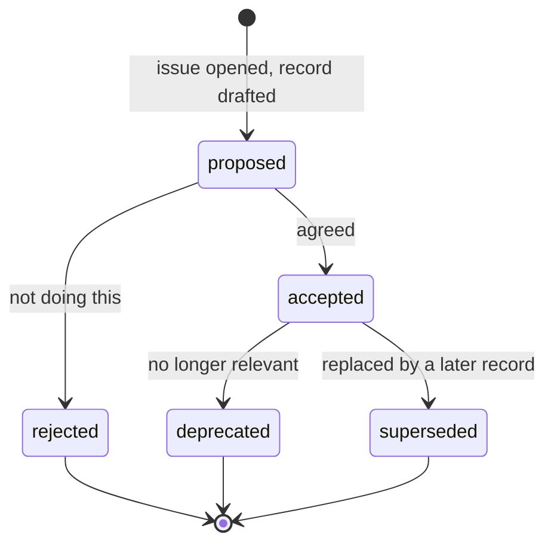

# Decision process

Architecture is decided in issues and recorded in decision records.
A pull request that makes an architectural choice in passing will be asked to come back and do this first.

## When a record is required

If a choice satisfies any of these, it needs one:

- It would be expensive to reverse once code depends on it.
- It closes off an option somebody would reasonably expect to be open.
- It contradicts something already written in the specification.
- Two competent people could disagree and both be defensible.
- It concerns a constraint, a non-goal, or a safety property.

If none apply, it is an implementation choice. Make it, and explain it in the code.

## The lifecycle

A rejected record stays in the repository.
The reasoning for not doing something is worth as much as the reasoning for doing it, and without the record the same proposal returns every six months.

## The rule that matters most

**A record is not accepted without evidence behind it.**

For most of this project's blocking decisions that means a timeboxed experiment: capture a thousand frames from a real game, inject input into a real game, measure inference on the target hardware.

A record written without one is a guess in a smart format, and it will be sent back.
The [known-good matrix](../known-good-matrix.md) lists the experiments that are outstanding.

## Numbering

Four digits, assigned once, never reused, never renumbered.

Gaps are normal and carry information — `0037` and `0038` are unused because a direction was considered and dropped, and renumbering would break every reference that already points at a record.

## Superseding

A record is never edited to change its decision.
It gains a `superseded_by` field, and the new record explains what changed and why the original reasoning no longer holds.

Editing a record to say something different destroys the only thing it was for.

## Who accepts

The architecture owner, listed in the code owners file.
The specification and the decision records require that review; everything else is open.
