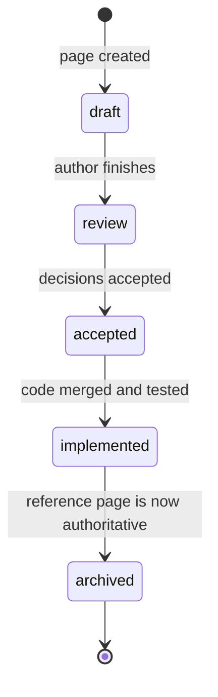

# Documentation guide

This project writes its documentation before its code.
That inverts the usual relationship: the specification is not a description of what exists, it is the instruction for what to build.
Everything in this guide follows from that one fact.

Read this before writing a page.
Most of it is enforced by CI, and finding out from a failed build is slower than reading it here.

## The five areas, and the one we added

We use [Diátaxis](https://diataxis.fr/), which divides documentation by what the reader is doing: learning, achieving a goal, looking something up, or understanding.
Diátaxis assumes the software exists.
Ours does not yet, so we add a fifth area — `spec/` — and a rule for retiring it.

| Area | Answers | Mood | Reader |
| --- | --- | --- | --- |
| `spec/` | What the system MUST do | Normative | Implementers |
| `decisions/` | Why we chose this, at the time | Point-in-time record | Everyone |
| `reference/` | What exists right now | Descriptive | Users, implementers |
| `how-to/` | How do I achieve X? | Task-oriented | A user with a goal |
| `tutorials/` | Teach me by doing | Learning-oriented | A newcomer |
| `explanation/` | Why is it like this? | Discursive | The curious |

The `spec/` area shrinks as `reference/` grows:



A specification page is never deleted.
It moves to `docs/spec/_archive/` and its `superseded_by` field points at the reference page that replaced it.
The decision records link to it, and deleting it would orphan that history.

### Two rules that keep the specification honest

**Specification pages contain no code you intend to keep.**
They carry schemas, state machines, invariants, identified requirements, and pseudocode fenced as `text` — never as `rust` or `csharp`.
Real code lives in `reference/` and is included from source files, never pasted.

**Every normative statement carries an identifier.**
This is the highest-leverage convention in the project.
Identifiers join documentation, decisions, issues, code and tests, which turns "did we build what we specified?" into a CI query instead of a judgement call.

## Requirement identifiers

Format is `<KIND>-<AREA>-<NNN>`, three digits, never reused, never renumbered.

| Kind | Meaning |
| --- | --- |
| `FR` | Functional requirement — something the system does |
| `NFR` | Non-functional requirement — a bound on how well it does it |
| `INV` | Invariant — something true at all times, not only at a step |
| `CON` | Constraint — something imposed on us from outside |

Constraints are the exception to the format: they are written `CON-<NNN>` with no area, because a constraint applies to the whole system rather than to one subsystem.
They are defined once, in [scope and goals](../spec/00-scope-and-goals.md), and referenced from everywhere.

| Area | Subject |
| --- | --- |
| `PERC` | Perception: capture, OCR, element detection, observation assembly |
| `LOOP` | Reasoning: cadences, planning, stuck detection |
| `ACT` | Action: vocabulary, executor, input injection |
| `GND` | Grounding and verification |
| `SKILL` | Skills and tool dispatch |
| `CTX` | Context assembly, compaction, research |
| `GUI` | Application shell and overlay |
| `CFG` | Configuration |
| `SAFE` | Safety interlocks and limits |
| `OBS` | Observability |
| `MODEL` | Model contract and inference hosting |

Write requirements as tables, one row per identifier, with a verification method on every row.
A requirement nobody can check is a wish.

**Defining versus restating.**
An identifier is *defined* exactly once, in a table row whose first cell is the identifier in backticks.
Other pages *restate* requirements freely — it is often the clearest thing for a reader — but a restatement links to the definition rather than repeating the table row:

- Definition, in the requirements page: a table row whose first cell is the identifier in backticks.
- Restatement, anywhere else: a linked identifier in prose or a list.

The identifier check relies on this distinction, and will report a duplicate definition if a restatement copies the table form.

Use [RFC 2119](https://www.rfc-editor.org/rfc/rfc2119) keywords — MUST, MUST NOT, SHOULD, SHOULD NOT, MAY — in uppercase, and only inside normative statements.
Uppercase them nowhere else; their whole value is that they are unambiguous wherever they appear.

## Front matter

Every Markdown file under `docs/` carries YAML front matter.
A CI check validates it against a schema, so a missing field fails the build.

```yaml
title: Action and input
description: Normative specification of the action vocabulary and the input executor.
status: draft            # draft|review|accepted|implemented|deprecated|superseded
owner: m4tr1x-dev
created: 2026-09-12
last_reviewed: 2026-09-12
applies_to: unreleased   # or a version range
tags: [spec, core, action]
requirements: [FR-ACT-001, INV-ACT-001]
decisions: [ADR-0009, ADR-0035]
generated: false
```

Additional fields by area:

- `spec/` — `requirements` and `decisions` are mandatory and non-empty.
- `decisions/` — MADR fields (`date`, `deciders`, `consulted`, `informed`) plus `affects` and `spec`.
- `reference/` — `generated` is mandatory; when true, add `generated_from` and do not edit the file by hand.
- `tutorials/` — `last_verified` and `verified_against` are mandatory, because tutorials rot faster than anything else.

The `title` field must match the page's single H1 exactly.

## Voice

| Context | Person | Example |
| --- | --- | --- |
| `spec/`, `reference/` | Third, about the system | The core emits a `TickStarted` event. |
| `tutorials/`, `how-to/` | Second, imperative | Open Settings, then select Capture. |
| `explanation/`, `decisions/` | First person plural | We chose Rust because the frame pipeline allocates heavily. |

Never write "you" in a specification.
Never write "we" in a reference page.
Opinion belongs in `explanation/` and `decisions/`, and nowhere else.

**Present tense everywhere.**
Future tense is banned in `spec/` and Vale enforces it.
"The core will expose a metrics endpoint" is a promise; "The core exposes a metrics endpoint" is a requirement someone can implement and test.
Whether the behaviour exists yet is carried by `status`, not by grammar.

## Mechanics

- **Semantic line breaks.** One sentence per line; break long sentences at clause boundaries. This is why `MD013` is off. It makes a review diff point at the sentence that changed instead of at the whole paragraph.
- **Headings** in sentence case. One H1 per page. Never skip a level.
- **Dates** in ISO 8601, so `2026-09-12`.
- **Numbers**: spell out zero through nine in prose; use numerals for measurements, versions and identifiers.
- **Units** always explicit — `ms`, `MiB` for memory, `px` with its coordinate space named. Never write a bare number for a duration or a size.
- **Code in prose**: backticks for identifiers, paths, keys and commands. Windows paths use backslashes.
- **Placeholders** in angle brackets, never square brackets, which collide with link syntax.
- **Links** carry descriptive text. Never "click here", never a bare URL. Internal links are relative so they resolve both on GitHub and in the built site.
- **Admonitions** use Material syntax. Reserve the `danger` level for input injection and safety topics; using it for anything else dilutes it to nothing.
- **Screenshots** sparingly, because they rot. Always with alt text, light theme, default Windows 11 settings, no personal data visible.

## Words we do not use

Two of these fail the build. Two are flagged for you to think about and do not
block, and the split is deliberate — see below.

**Bot, cheat, hack, exploit, aimbot.**
Two reasons.
Technically they are wrong: this software injects no code, hooks nothing, reads no game memory, and acts only through public Windows APIs — the same surface a screen reader uses.
Legally they are careless: those exact words appear in the terms of service we ask users to read carefully, and using them about our own software concedes a characterisation we do not accept.
Write "agent" and "automation".

**Future tense in `spec/`** — will be, shall be, eventually, for now.
A specification describes a system in the present tense; whether it exists yet
is carried by `status`, not by grammar. This one fails the build, because there
is no legitimate exception inside a specification.

### Flagged, but advisory

**Simply, just, easily, obviously, clearly, trivially.**
Anyone reading a how-to guide has already failed at something, and telling them
the step is easy adds nothing when it works and insults them when it does not.

**Vague quantifiers** — fast, robust, scalable, reasonable, several, sufficient.
In a normative statement each of these hides a decision nobody has made. If a
latency budget is "fast", no one can implement it and no test can check it.

Both are warnings rather than errors, and the reason is honest: a file-level
linter cannot tell a requirement table row from the prose around it.
"Many games expose no accessibility tree" is an accurate statement about the
world, and "trivially detectable" is a precise technical claim rather than
condescension. Gating on these would mean mangling correct prose to satisfy a
rule written for a narrower target.

They appear in every local run and as annotations on every pull request.
**Where they matter — inside a requirement, a budget or an invariant — they are
caught in review, and a reviewer should treat one as a defect.**

## Diagrams

Mermaid, inline, as the default and near-exclusive tool.
It is the only option that renders natively both on GitHub — so a reviewer sees the diagram in a pull request diff — and in the built site, with no build step.

Do not use Mermaid's C4 diagram types.
They have been experimental with unstable syntax for a long time, and the Mermaid version GitHub bundles may lag the one Material ships.
Express C4 with a plain flowchart plus our conventions: rectangle for a container, stadium for a person, rounded for an external system, a technology suffix in the label, and a shared class definition palette.

Every diagram is followed by a prose paragraph describing it.
Search indexes prose and not SVG, and a reader using a screen reader gets nothing from the diagram alone.

If a diagram genuinely cannot be expressed in Mermaid, commit the source under `docs/diagrams-src/` and the rendered SVG under `docs/assets/diagrams/`, and render in CI so a stale SVG fails the build.
Use this rarely.

## Keeping documentation from drifting

Four mechanisms, weakest to strongest.

1. **Pull request checklist** — a free-text justification, which works better than a bare checkbox.
2. **Soft CI signal** — a label when source changed and documentation did not, with a comment naming the specification pages that reference the touched paths. Deliberately not a hard failure; hard-failing this trains people to make token edits.
3. **Generated-reference freshness, a hard failure.** CI regenerates every generated page under `reference/` and compares against what is committed. If they differ, the build fails. This makes structural drift impossible rather than discouraged, and it is the highest-value gate we have.
4. **Snippet integrity, a hard failure.** Code shown in documentation is included from a real source file by marker. Delete or rename the marker and the strict build fails.

Never paste code into a page.
Include it by marker, using the snippet syntax that `pymdownx.snippets` provides.

## Language

English is the only normative language in this repository — code, identifiers, comments, commit messages, issues, decisions, specification, reference, and every hand-written page.

Polish is permitted in exactly two places: user-interface strings, through proper resource localisation, and translations of tutorials and how-to guides under `docs/pl/`, each carrying a banner stating that the English version is authoritative and may be newer.

Never translate `spec/`, `decisions/` or `reference/`.
A bilingual specification becomes two contradictory specifications within months, and the moment they disagree nobody can say which one the code was built against.
Do not start translations until the specification has stopped churning.

Spelling is **British English**, enforced by cspell: behaviour, synthesise, licence, optimisation, stylised.

The obvious counter-argument is that the surrounding ecosystem is US-spelled — `Color`, `Initialize` and `Analyzer` appear in the APIs we call.
That is true and it does not apply, because those are identifiers.
An identifier keeps whatever spelling its author gave it, it appears in backticks, and it is never subject to this rule.
The rule governs prose, and mixing conventions inside one paragraph reads worse than either convention does on its own.

If you are used to US spelling, write it and let cspell correct you; that is what it is for.

## Page templates

Consistent structure is what makes ninety pages feel like one document.

A **specification page** has these sections, in this order: Purpose, Requirements, Design, Interfaces, Invariants, Open questions, Related decisions.
An empty Open questions section is a claim that there are none, so write it deliberately.

A **how-to guide** has: Before you start, Steps, Verify it worked, If it still fails, Related.
Steps are numbered and imperative, one action each.

An **explanation page** opens with the question it answers, builds an argument in sections, and closes with what that means in practice.

A **tutorial** has a stated outcome, a prerequisites list, numbered steps that always work, and a closing section telling the reader what they just proved.
Tutorials ask the reader to make no decisions.

## Running the checks locally

Install the pinned documentation toolchain:

```bash
pip install -r docs/requirements.txt
```

Build the site strictly, which catches broken navigation, missing snippets and bad internal links:

```bash
mkdocs build --strict
```

Lint Markdown structure:

```bash
npx markdownlint-cli2 "**/*.md"
```

Lint prose:

```bash
vale docs/
```

Check spelling:

```bash
npx cspell "docs/**/*.md"
```
