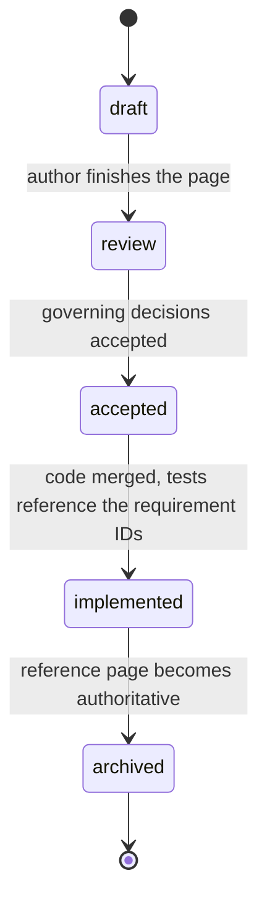

# ADR-0001 — Documentation toolchain and the docs-as-spec workflow

## Context and problem statement

The repository contains no code.
The documentation being written now is not a description of a system; it is the specification from which the system will be built, and later it must become the reference material for the system that exists.

That gives the toolchain two jobs that ordinary documentation tooling does not have.
It must make the transition from normative specification to descriptive reference explicit rather than implicit, and it must make documentation drift detectable by a machine, because a specification that quietly stops matching the code is worse than no specification at all — it actively misleads.

A third constraint comes from the stack.
The repository will contain Rust and C#, and their API documentation is generated by two different, non-negotiable tools: rustdoc and DocFX.
Neither understands the other's model.

Which toolchain do we use, how do the three generators combine, and what is the lifecycle that carries a page from specification to reference?

## Decision drivers

- **Code inclusion from real source files.** The strongest available anti-drift mechanism is to never paste code into documentation. Whatever we pick must support including code by marker and must fail the build when the marker disappears.
- **Renders diagrams on GitHub and in the site from one source.** Reviewers read pull request diffs on GitHub; readers read the site.
- **No new language runtime in the build.** This is a Rust and C# repository. Adding a JavaScript toolchain to render Markdown is a dependency tree and a lockfile we would maintain forever for no user-visible benefit.
- **Search across roughly ninety pages.** Browsing stops working well before that.
- **Must coexist with rustdoc and DocFX** without trying to absorb them.

## Considered options

1. MkDocs with Material for MkDocs as the hub
2. Plain Markdown rendered by GitHub, no site
3. DocFX for everything
4. mdBook
5. Docusaurus
6. Astro Starlight

## Decision

**MkDocs with Material for MkDocs** as the hub, with **DocFX** and **rustdoc** output mounted underneath it as static sub-sites, published to GitHub Pages from Actions.

```text
site root
├── /              MkDocs Material  — specification, decisions, guides, hand-written reference
├── /api/dotnet/   DocFX            — generated from C# XML documentation comments
└── /api/rust/     cargo doc        — generated by rustdoc
```

The publish workflow runs DocFX, then `cargo doc`, copies both into the MkDocs output directory, then runs `mkdocs build --strict` and deploys the result.

We do not attempt to cross-generate — feeding rustdoc's JSON output into DocFX, or the reverse — at any point.
It is a maintenance sink with no benefit to any reader.

For the first months, links from specification pages into the generated API documentation point at **module granularity, not item granularity**.
Item paths in young code move constantly, and a link checker that fails on every refactor gets disabled.

### The specification lifecycle



A page's `status` front-matter field drives a visible banner on the rendered page.
Once a subsystem ships, its specification page moves to `docs/spec/_archive/` with a `superseded_by` pointer, and the corresponding `reference/` page becomes the single source of truth.
The specification page is never deleted, because the decision records point at it.

### The drift gates

Four mechanisms, in increasing order of strength.

1. A pull request checklist asking for a free-text justification when documentation was not updated.
2. A soft CI signal: a label and a comment when source changed and documentation did not, naming the specification pages that reference the touched paths. Deliberately not a hard failure — hard-failing this trains people to make token edits.
3. **Generated-reference freshness, a hard failure.** CI regenerates every page marked `generated: true` and fails if the result differs from what is committed. This makes structural drift impossible rather than merely discouraged, and it is the single highest-value gate in the set.
4. **Snippet integrity, a hard failure.** Every code sample longer than a few lines is a `pymdownx.snippets` include pointing at a marker in a real source file. Deleting or renaming the marker fails `mkdocs build --strict`.

## Consequences

### Good

- `pymdownx.snippets` with `check_paths` turns a missing marker into a build failure, which is the mechanism the whole docs-as-spec approach depends on.
- The build needs only Python. A contributor with the Rust and .NET toolchains installed adds one `pip install` and nothing else.
- Mermaid fences render on GitHub and in Material from the same source, so diagrams are reviewable in a pull request diff.
- Material's navigation maps cleanly onto the six areas, and its client-side search works offline in the built site.
- Versioned documentation is available through `mike` when there is something to version.

### Bad

- Three generators means three ways the publish workflow can break, and the failure modes are unrelated to each other.
- Mounting static output under the hub means the site search covers the hand-written pages but not the generated API documentation. Readers looking for a type name will use the API sub-site's own search instead. This is an acceptable seam; merging the indexes is not worth the effort.
- Material ships releases often enough that an unpinned build will eventually break for reasons unrelated to any change we made. We pin exactly, which means we also carry the upgrade work.

### Neutral

- The site is Python-built and the product is not. Contributors working only on code never run it; the CI does.

## Validation

This decision is working if a pull request that renames a public Rust function and forgets the documentation fails CI, with a message naming the file to fix.

It is failing if contributors start pasting code into pages to avoid the snippet mechanism, or if the generated-freshness gate is disabled because it fires too often.
The second would indicate the generators are non-deterministic, which is a bug in the generator scripts rather than a reason to remove the gate.

## Pros and cons of the options

### MkDocs with Material for MkDocs

A Python static site generator with a mature documentation theme.

- Good, because `pymdownx.snippets` provides marker-based code inclusion that fails the strict build when broken.
- Good, because the build has one runtime dependency and it is not the product's.
- Good, because Mermaid works through `superfences` with no build step and the same fences render on GitHub.
- Bad, because it knows nothing about C# or Rust API documentation, so the API sub-sites are mounted rather than integrated.

### Plain Markdown on GitHub

- Good, because it costs nothing and every Markdown file we write is portable to any of the other options.
- Bad, because at ninety pages there is no search, no generated API reference, no snippet inclusion, no versioning, and no link checking that understands relative paths across directories. Reasonable for the first month; untenable by the third.

### DocFX

Microsoft's documentation generator, which handles both C# API extraction and conceptual Markdown.

- Good, because it is the native .NET API documentation tool and we use it for exactly that.
- Bad, because its conceptual-authoring experience, theming and extension ecosystem are well behind Material, Mermaid needs template work, and it has nothing to offer for Rust. Using it as the hub would mean accepting a worse authoring experience for the ninety pages that are not API reference.

### mdBook

- Good, because its include directive with anchors is comparable to Material's snippets, and it is the Rust ecosystem's native choice.
- Bad, because it is built for a linear book. A six-area reference site with deep navigation and faceted search is not what it does well, and it has nothing for C#.

### Docusaurus

- Good, because MDX allows genuinely interactive explanation pages, and the ecosystem is large.
- Bad, because it brings Node, a lockfile and a large transitive dependency tree into a repository that otherwise has none. Its versioning model also duplicates whole documentation trees on disk, which is painful while the specification is still churning.

### Astro Starlight

The runner-up, and the better choice under different priorities.

- Good, because it produces the best-looking result and could double as the project's marketing site.
- Good, because interactive components in explanation pages would suit the grounding and perception topics well.
- Bad, because it brings the same Node toolchain objection as Docusaurus, with a younger plugin ecosystem.
- Pick this instead if the documentation site later needs to be the public face of the project rather than a reference for its builders.

## More information

- The site configuration is in `mkdocs.yml` at the repository root; the pinned toolchain is in `docs/requirements.txt`.
- Conventions that follow from this decision are in the [documentation guide](../contributing/documentation-guide.md).
- **Needs verification**: the pinned versions in `docs/requirements.txt` were written without resolving them against a live package index. Resolve them, correct anything that fails, and record the date in that file.
