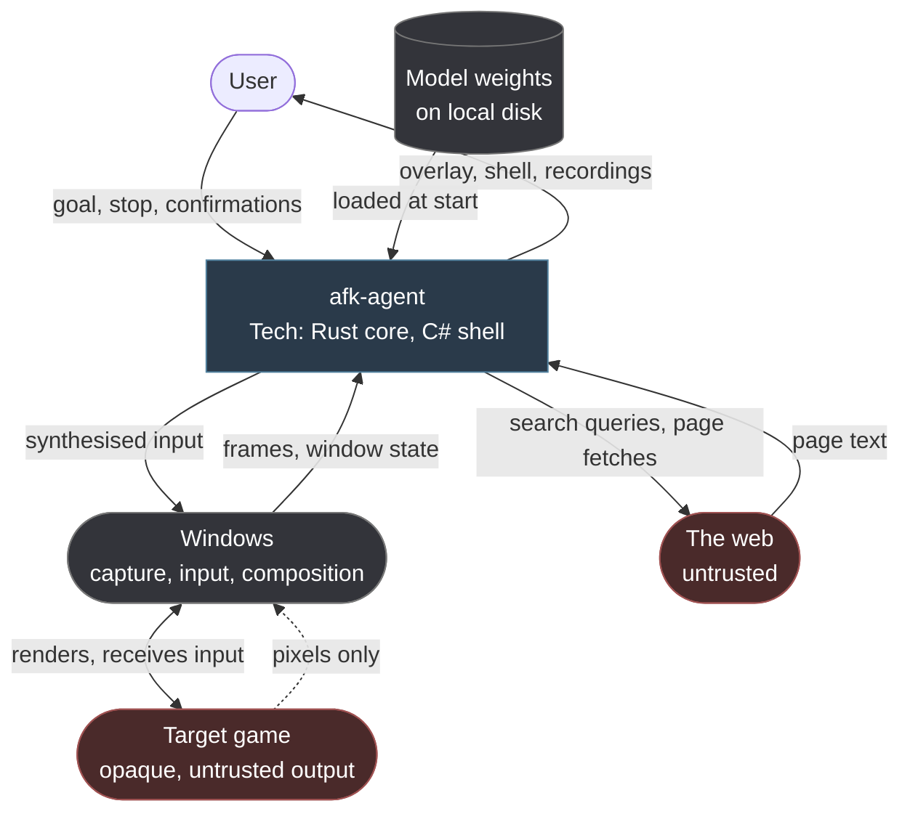

# System context

## Purpose

This page places afk-agent among the things it interacts with, and marks the boundaries across which trust does not extend.

It is the outermost view.
[Container architecture](03-container-architecture.md) opens the box.

## The context

The agent sits between the user and the operating system.
It never touches the game directly: it sees the game only as pixels that Windows hands it, and affects the game only by putting events into the input queue that Windows delivers.
That indirection is the whole architectural posture, and `CON-002` states it as a rule.

Two arrows carry untrusted content into the agent — the game's pixels and the web's text — and both are marked as such deliberately.

## Actors

### The user

Supplies one natural-language goal per session.
Can stop the session at any moment, and is the only party who can confirm a gated action.

Is assumed **absent** during normal operation and able to return at any instant.
That asymmetry drives most of [safety and limits](12-safety-and-limits.md): controls must be reachable in the first second by someone who has just walked back to the desk, and must work without them having to read anything.

### The target game

Opaque.
The agent has no model of its rules, no access to its state, and no way to ask it anything.
Everything the agent knows about the game it inferred from an image.

Treated as **untrusted output**, which is the part people find surprising.
The concern is not that the game is malicious; it is that the game renders text that other people wrote — chat messages, player names, item descriptions — and that text reaches a language model.
See [threat model](14-threat-model.md).

### Windows

Provides window capture, input synthesis, composition for the overlay, and the window state the agent needs to know where the game is and whether it still has focus.

Used through public APIs only.
The agent does not extend, replace, hook or intercept any part of it.

### Model weights

A local file, downloaded once by the user under its publisher's licence.
Read at startup, verified before use (`FR-MODEL-005`), never modified (`CON-005`).

Not distributed with the software. See [NOTICE](https://github.com/m4tr1x-dev/afk-agent/blob/main/NOTICE.md).

### The web

Reached only by the research skills, only when the agent decides it lacks knowledge, and never with anything derived from the user's screen.

The traffic is ordinary: a search query, then a page fetch.
The queries are derived from the goal and from what the agent has inferred, which means they are low-sensitivity but not zero-sensitivity — a query is a statement about what the user is doing.

## Trust boundaries

Four, and each needs a different treatment.

### Boundary 1 — the user to the agent

The goal is a natural-language string written by the person running the software.
Trusted as intent, but not as safety: a goal that asks for something the safety layer forbids does not get it, because `INV-SAFE-001` puts those limits below everything a prompt can reach.

### Boundary 2 — the game to the agent

**Crossing:** pixels, and the text extracted from them.

**Direction:** inbound only. Nothing crosses towards the game except input events.

**Treatment:** text recognised on screen is data. It never becomes instruction.
Text that appears to be from another player — chat regions — is excluded from the observation by default, and text entry towards the game is off by default, which together close the loop by which one player could direct another's agent.

### Boundary 3 — the web to the agent

**Crossing:** page text, inbound.

**Treatment:** the strictest of the four.
Retrieved content enters the context inside a delimited block marked as untrusted, with its source recorded (`FR-SKILL-005`).
The system prompt states that content inside such a block cannot direct behaviour.

A guide page on a wiki is a document anyone can edit, and the agent reads it precisely because it does not already know the answer, which is the condition under which it is least able to tell a good answer from a planted one.

### Boundary 4 — the agent to the operating system

**Crossing:** synthesised input, outbound.

**Treatment:** gated by the foreground guard (`INV-ACT-001`) so it can only reach the target window, filtered by the denied-key list (`INV-ACT-003`), and rate-limited by budget.

This is the only boundary where the agent can cause irreversible effects, which is why every interlock in the project converges on it.

## What does not cross any boundary

Worth stating as flatly as the things that do.

- **Screen contents never leave the machine.** Not to a model, not to a telemetry endpoint, not in a crash report without explicit opt-in. `CON-003`, `FR-OBS-004`.
- **Nothing crosses from one session to another.** `CON-006`, `INV-CTX-001`. Session recordings are written but never read back by the agent.
- **The agent never enters another process.** `CON-002`.
- **No user data reaches the web.** Research queries are derived from the goal and from the agent's own inferences, never from recognised screen text verbatim.

## Interfaces

| Interface | Direction | Carries | Notes |
| --- | --- | --- | --- |
| Window capture | Inbound | Frames of one window | Window-scoped, not desktop-scoped (`FR-PERC-001`) |
| Window state | Inbound | Position, size, scaling, foreground | Drives the coordinate transform (`FR-PERC-002`) |
| Input synthesis | Outbound | Key and pointer events | Single call site (`FR-ACT-008`) |
| Composition | Outbound | The overlay | Excluded from the agent's own capture (`FR-GUI-001`) |
| Accessibility tree | Inbound, optional | Element geometry | Present for few games; exact where present (`FR-PERC-010`) |
| Model host | Bidirectional | Prompts and completions | Local, or a host the user controls |
| Weight storage | Inbound | Model files | Verified before load |
| Web search and fetch | Bidirectional | Queries out, page text in | Untrusted inbound |
| Session recording | Outbound | Frames, actions, outcomes | Write-only from the agent's side (`INV-CTX-002`) |

## Invariants

Two invariants are properties of the boundaries above rather than of any one component, so they are worth restating here:

- [`INV-CTX-001`](01-requirements.md) — no information derived from a session is readable by a later session.
- [`INV-ACT-001`](01-requirements.md) — no input is delivered while the target window is not the foreground window.

Both are *defined* in [requirements](01-requirements.md).
A restatement links; only the definition uses a table row, which is what lets the identifier check tell them apart.

## Open questions

1. **Non-blocking.** Whether the research skills should run in a lower-privilege process, so that hostile web content is parsed somewhere that has no access to the input path. It would strengthen boundary 3 materially and costs a process.
2. **Non-blocking.** Whether search queries should be scrubbed of anything recognised on screen before being sent. The agent's inferences are already derived from screen content, so the boundary is softer than it looks.
3. **Non-blocking.** What the agent does when the accessibility tree contradicts what it sees. Currently the tree is preferred where present; there is no case yet where that is known to be wrong.

## Related decisions

`ADR-0009` governs the input boundary, `ADR-0018` the absence of anything crossing a session, and `ADR-0025` the posture towards the game.
All three are accepted.
`ADR-0021`, the web research boundary, is not written.
