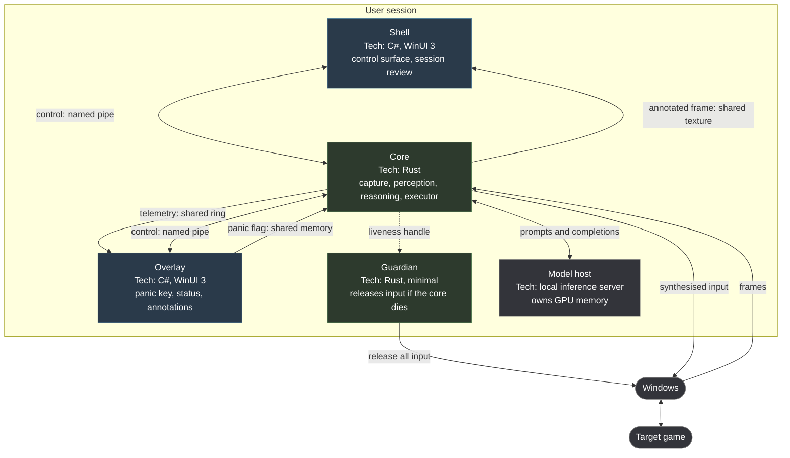
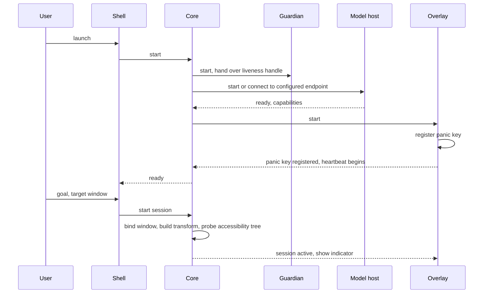

# Container architecture

## Purpose

This page opens the box drawn in [system context](02-system-context.md): how many processes there are, what each owns, how they communicate, and what happens when one of them dies.

Process boundaries here are not organisational.
Each one exists because something on the other side of it must survive the failure of something on this side.

## The containers

Five processes, all in the user's own session.

## Why each boundary exists

### The core is separate from the shell

The agent must outlive its window (`FR-GUI-004`).
A user who starts a session and closes the control window has not asked for the session to stop, and a crash in a XAML layout pass must not take down something that is holding a key down in a game.

### The overlay is separate from the shell

The overlay owns the panic key and the visible indicator, and `INV-GUI-001` requires its lifetime to be independent.
Those two things must be present whenever the agent can act, which means they cannot live in a window the user is free to close.

It is also the process best suited to the job: it does no inference, no capture and no large allocation, so it is the one least likely to be blocked when the user needs it.

### The model host is separate from the core

Two reasons, and the second is the one that decides it.

A graphics-memory exhaustion or a display-driver reset should not take down the agent.
Those are recoverable events for a process that only talks to the model host over a socket, and fatal for one that has the inference runtime loaded in-process.

More importantly, making the model an **endpoint rather than a library** means it can be somewhere else.
On a machine whose graphics memory is fully occupied by the game, the best available answer is to run the model on another machine on the user's own network, and that should be a configuration change rather than a rewrite.

### The guardian is separate from everything

Its entire purpose is to act when the core is gone (`FR-SAFE-003`).
A mechanism for handling the core's death cannot live inside the core.

It holds a handle to the core process and a read-only view of the shared memory the executor publishes held input into.
When the core exits without having cleared that set, the guardian releases it.

It contains no model, no capture, no configuration, and as little code as the job permits, because the one failure it must not share is whatever killed the core.

### The core is not a Windows service

Stated explicitly because it is the intuitive design and it does not work.

Session 0 isolation means a service cannot synthesise input into the user's desktop session and cannot capture their windows.
"Headless" here means *without a user interface*, not *in session 0*.

The core runs as an ordinary user process, optionally started at logon by a scheduled task.
It needs no elevation (`CON-007`): a process with a window handle has everything it requires.

## Communication

Three channels with different shapes, because one channel cannot serve all three.

### Control plane — named pipe

Carries commands, events and queries between the core and the two user-interface processes.
Message-framed, with a length prefix and a compact binary encoding.
Access-controlled to the current user.

Volume is low — session start and stop, plan updates, log events, skill results — and latency is not critical.
Everything structural about it is specified in [inter-process protocol](10-ipc-protocol.md).

### Telemetry plane — shared memory ring

Carries what the overlay draws every tick: mark boxes, the current plan step, sensor values, the action in flight.

A ring buffer with a per-slot sequence counter.
The writer increments the counter before and after writing; a reader that observes an odd counter or a changed one retries, and is free to drop frames it could not read in time.

The overlay is a display, not a subscriber that must see everything.
Dropping a frame is correct behaviour, and a protocol that could block the core because a reader was slow would be a defect.

This channel stays small — vector data, never pixels.

### Frame plane — shared texture

For the shell's live annotated view.

Copying pixels through a pipe at tick rate is not affordable.
The core renders the annotated frame into a texture created as shareable, passes the handle to the shell over the control pipe, and the shell binds it directly for display.
No copy through main memory, no serialisation.

Used only when the shell is open and displaying the live view.

### Panic plane — a single shared flag

A separate, minimal shared allocation holding one value, polled by the core's reflex loop every tick.
The overlay sets it.

It is separate from everything else because it must work when the pipe is dead, when the ring is full, and when the core is in a state where nothing else is being serviced.

## Failure domains

| What fails | Effect | Recovery |
| --- | --- | --- |
| Shell | Session continues; live view lost | Restart the shell, reattach to the running core |
| Overlay | **Session stops.** The dead-man switch requires it. | Restart the overlay, then the session |
| Core | Guardian releases all input; session ends | Restart; session state is not resumed |
| Model host | Core pauses the session, reports, and offers a retry | Restart the host, or point at another endpoint |
| Guardian | Logged as degraded; session continues without the crash-safety net | Restart the core to restart the guardian |
| Game | Detected as target-window loss; session stops | User's problem |

The overlay row is the one that surprises people.
It looks harsh to stop a working session because a status window died, and it is deliberate: the overlay carries the panic key and the visible indicator, so without it the user has neither a way to stop the agent nor a way to know it is running.
An agent with hands and no visible stop control is exactly what this project must never produce.

## Startup

The ordering carries one rule: **the core does not accept a session until the overlay has confirmed the panic key is registered.**
A session that could start without a working stop control would be a session that can only be stopped by killing a process.

If registration fails — another application already holds the combination — the core refuses to start a session and the shell explains why.
This is open question 4 in [safety and limits](12-safety-and-limits.md); currently there is no fallback and there needs to be one.

## Shutdown

Ordered, and the order is not negotiable:

1. Stop accepting new actions.
2. Cancel every scheduled sustained action.
3. **Release every held input.**
4. Cancel inference in flight.
5. Flush the session recording.
6. Tear down the model host if the core started it.
7. Signal the guardian to stand down, so it does not interpret a clean exit as a crash.
8. Exit.

Step 3 happens before anything that can fail.
If the recording flush hangs, the user still has their keyboard back.

## Threading inside the core

| Thread | Owns | Rate |
| --- | --- | --- |
| Capture | Frame arrival, the graphics device | Frame rate |
| Reflex | Sensors, executor stepping, interlocks, panic flag | 20–30 Hz |
| Worker pool | Text recognition, element detection, image matching | As work arrives |
| Accessibility | Accessibility-tree queries, isolated and time-boxed | On demand |
| Async runtime | Model calls, skills, pipe and ring traffic | Event-driven |

The reflex thread is the one with a hard deadline.
Nothing it does may block on the network, on inference, on a lock held by a worker, or on the accessibility tree — that last one being a genuine hazard, since a query against a busy target can take tens of milliseconds or hang.

The accessibility bridge therefore runs on its own thread with a hard timeout and never sits on the critical path.
Its results are folded into whichever observation is being assembled when they arrive, or discarded.

## Deployment

One installable package containing the five executables.
Model weights are fetched on first run, not bundled.

No elevation, no service registration, no driver.
Uninstalling removes the executables; recordings and configuration live under the user's profile and are removed on request.

## Open questions

1. **Non-blocking.** Whether the research skills should run in a sixth, lower-privilege process, so hostile page content is parsed somewhere with no access to the input path. It strengthens the boundary materially; the cost is a process and a serialisation hop.
2. **Non-blocking.** Whether the shell should be able to attach to a core it did not start — a user closing and reopening the control window mid-session. Desirable, and it means the pipe needs a discovery and reattach protocol.
3. **Blocking.** Whether the guardian should enforce the session wall-clock budget as well, so that a core which hangs while holding input stops on its own rather than waiting for a human.
4. **Blocking.** Whether the model host should be started by the core or supervised independently. Independent supervision survives a core restart and keeps the model resident, which matters because loading weights is slow.
5. **Blocking.** What happens to a session when the machine sleeps. Currently undefined, and a session that resumes after an hour into a changed game state is a hazard.

## Related decisions

`ADR-0003` records the topology, `ADR-0004` the control transport and `ADR-0005` the data-plane transports.
All three are accepted.
`ADR-0006`, the model host, is not written and is blocked on the backend measurement.
