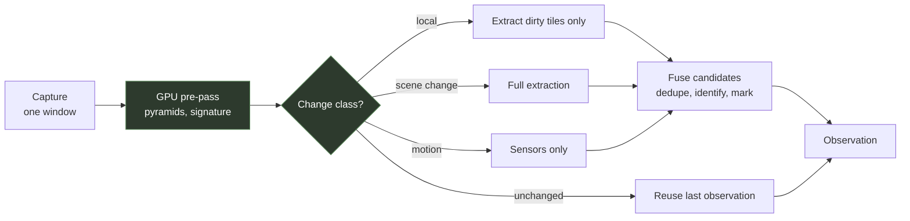

# Perception

## Purpose

This page specifies how a captured window becomes an observation: a structured description of what is on screen that a model can reason about and the executor can act on.

It does not cover how a target is chosen from that observation — that is [grounding and verification](18-grounding-and-verification.md) — nor what is done with it, which is [the reasoning loop](05-reasoning-loop.md).

The governing constraint is economic.
A vision model cannot look at every frame; the arithmetic is in [performance budgets](15-performance-budgets.md) and it is not close.
Most of this page exists to make the model's attention affordable.

## The pipeline



Five stages.
The classifier is the one that matters: it decides how much of the rest runs, and on most frames the answer is almost none.

## Capture

`FR-PERC-001`, `FR-PERC-009`.

**Window-scoped, not desktop-scoped.**
The agent captures one window, identified by its handle.

This is a privacy property before it is a convenience.
A desktop-scoped capture would put the user's other windows into the observation, into the model's context, and into the session recording, and no amount of cropping afterwards un-captures them.

**Cursor excluded.**
The agent knows where it put the pointer; including it contaminates change detection with the agent's own movement.

**Failure is reported, not papered over.**
When capture yields nothing usable, the cause matters: an unsupported window mode needs the user to change a setting, while a transient failure needs a retry.
Reporting "capture failed" for both is the difference between a five-second fix and an hour of confusion.
This is why `FR-PERC-009` distinguishes them.

### Coordinate spaces

`INV-GND-002`.
Four spaces, named, with one conversion chain, implemented once:

| Space | Origin | Units |
| --- | --- | --- |
| Capture | Top-left of the captured surface | Pixels at capture resolution |
| Client | Top-left of the target window's client area | Physical pixels |
| Screen | Top-left of the virtual desktop | Physical pixels |
| Injection | Virtual desktop | Normalised, as the input API requires |

Every grounded action walks capture to client to screen to injection.
**No other component performs coordinate arithmetic.**

This is stated as an invariant rather than a guideline because the failure is invisible.
A transform that is wrong under mixed display scaling produces clicks that land near the target, and "near" reads as a bad model rather than as a bad conversion.
It is also untestable after the fact without a machine configured the way the user's is.

`FR-PERC-002` requires the chain to be rebuilt when the window moves, resizes, changes scaling or changes monitor.
A stale transform is silently wrong, which is the worst kind of wrong.

## The GPU pre-pass

`NFR-PERC-002`.

**No full frame is read back to main memory.**

A single compute pass over each captured frame produces, on the graphics device:

- A **reasoning pyramid**, the resolution the model is shown.
- A **detection pyramid**, smaller, what the extractors run on.
- A **signature**: a perceptual hash of the frame, plus a coarse grid of per-tile statistics and per-tile differences against the previous frame.

Only the signature is read back — a small number of bytes rather than megabytes.

This is the design's central economy.
It is what allows change classification to run at full frame rate inside its budget, and everything downstream is gated on the tiny read-back rather than on a copy of the frame.

## Change classification

`FR-PERC-003`, `NFR-PERC-001`.

From the signature alone, each frame is classified:

| Class | Signal | What runs |
| --- | --- | --- |
| **Unchanged** | Hash distance below the low threshold, tile differences near zero | Nothing. The previous observation is reused verbatim. |
| **Local change** | A small number of dirty tiles | Extractors on those tiles only; the element list is patched |
| **Continuous motion** | Many dirty tiles, high difference, stable histogram | Sensors only |
| **Scene change** | Hash distance above the high threshold, or a large histogram or edge-density shift | Everything, and a deliberative pass is triggered |

The motion class is the one worth explaining.
When the camera is moving through a three-dimensional scene, running element detection produces a list of things that are not interface elements and will not be there next frame.
It costs the full extraction budget to produce noise.
Sensors — which read fixed screen regions — keep working, because a health bar stays where it is while the world moves behind it.

**The model is invoked on scene change, on a plan-step boundary, on a scheduled verification checkpoint, on stuck detection, or on a heartbeat.**
Never at frame rate.

## Extraction

Runs on the detection pyramid, restricted to dirty tiles where the class permits.

### Text

`FR-PERC-004`.
Two tiers, because game text is not document text.

The first tier is the platform's built-in recognition: fast, no model to ship, and good on clean interface text, which is most of what matters — counters, labels, button text.

The second tier is a heavier recogniser, escalated to only for regions where the first returns nothing or low confidence *and* the region looks like text by cheap measures such as edge density and stroke-width consistency.
Stylised fonts, outlined text over busy backgrounds, and non-Latin scripts are where the first tier gives up.

Output carries text, a quadrilateral, a confidence, and which tier produced it.
The tier matters downstream: a low-confidence reading from the second tier is weaker evidence than a high-confidence reading from the first.

### Elements

`FR-PERC-005`.
Four sources, fused later, each with different failure modes.

**A learned detector** proposes interactive regions.
Be honest about its training distribution: detectors of this kind are trained on web and desktop interfaces, and game interfaces are considerably more stylised.
Expect recall to degrade and do not treat its silence as evidence of absence.

**Classical proposals** cover the gap the detector leaves.
Game interfaces are geometrically regular in ways learned detectors miss: rectangles with uniform interiors and distinct borders, high-saturation connected regions, text-like blobs.
These are cheap, deterministic, and surprisingly strong exactly where the learned detector is weak.

**Template matching** against the session's template atlas — see below.

**The accessibility tree**, where the target exposes one (`FR-PERC-010`).
Most games expose nothing.
Some launchers, browser-hosted games and interface layers expose a full tree with exact rectangles, and where that is available it is better than anything inferred from pixels and costs nothing to ask for.

The accessibility query runs on its own thread with a hard timeout and **never blocks a tick**.
A query against a busy target can take tens of milliseconds or hang, and the reflex loop cannot wait for it.
Results are folded into whichever observation is being assembled when they arrive, or discarded.

### Sensors

`FR-PERC-008`.

A sensor is a named predicate over a fixed screen region, evaluated on the graphics device every reflex tick, without a model.
The deliberative cadence declares them; everything else reads them.

Three forms cover the cases that arise:

- A **fraction** of pixels in a region matching a colour range — health and progress bars.
- An **integer** read from a region by text recognition — counters, currency, scores.
- The **presence** of a template above a threshold — a panel, a dialog, a marker.

Sensors are what make [verification](18-grounding-and-verification.md) affordable.
Checking whether an action worked costs a fraction of a millisecond rather than a model call, and that difference is what allows every action to be checked rather than a sample of them.

### The template atlas

The one mechanism here that improves within a session.

When the agent interacts with an element and the outcome is **confirmed**, the element's image is kept.
On later frames, multi-scale matching finds that element deterministically, in about a millisecond, with no model involvement.

Over a session, a game's interface migrates from "the model works it out each time" to "it is a lookup".

Two constraints keep this honest:

- It lives in memory for the current session and is discarded with it. It is a cache, not knowledge. See [what the agent remembers](../explanation/what-the-agent-remembers.md).
- **Clearing it mid-session must make the agent slower, not wrong.** If clearing it changes what the agent can do, it has become a dependency, and that is a defect.

## Fusion

`FR-PERC-006`, `FR-PERC-007`, `INV-PERC-001`.

Candidates from the four sources are merged:

1. **Deduplicate** by overlap, keeping the highest-confidence source. Priority on ties: accessibility tree, then template, then learned detector, then classical proposal — ordered by how directly each source knows the geometry.
2. **Assign a stable identifier** derived from the scene class, the element's quantised position, its normalised text, and a perceptual hash of its appearance. Stability across consecutive observations is what lets a plan refer to something for longer than one tick (`FR-PERC-006`).
3. **Clip to the captured region.** `INV-PERC-001` — an element extending outside it would produce input outside the window, which the foreground guard rejects, costing a tick and corrupting the verification signal.
4. **Assign marks**: integers in reading order, rendered onto the reasoning-pyramid image as high-contrast numbered badges, with leaders where elements are dense.

## The observation

What the rest of the system consumes:

```text
tick, timestamp
scene class
screen dimensions, capture dimensions
elements[]      mark, id, bounding box, kind, text, confidence, source
text lines[]    content, quadrilateral, confidence, tier
sensors{}       name -> value
pointer position
last action + its verification outcome
change summary  one line of prose describing what differs from the previous observation
```

Plus one annotated image.

The change summary is small and does real work: it lets the model orient after a scene change without being shown the previous image, which is what keeps a multi-turn visual loop affordable.

`INV-PERC-002` requires observation timestamps to be monotonically non-decreasing, because deterministic replay depends on it.

## Interfaces

| Consumer | Receives |
| --- | --- |
| Reasoning loop | The observation, including the annotated image |
| Executor | Element geometry, for resolving a mark to a point |
| Verification | Sensor values, element presence, tile-level change |
| Overlay | Marks and boxes, through the telemetry ring |
| Session recording | The observation, and keyframe images subject to quota |

## Open questions

1. The thresholds separating the four change classes are empirical and need the recorded corpus. Written as configuration with placeholder defaults until then.
2. Whether the detection pyramid should be one resolution or adaptive per scene class. Menus and world views have very different element scales.
3. Whether the accessibility probe should run once per session or be re-run on scene change. Some targets populate their tree lazily, and a single probe at start would see an empty one.
4. How the template atlas ages within a long session. An element confirmed an hour ago may no longer mean what it did, and there is currently no mechanism that notices.
5. Whether the change summary should be produced by the small model rather than by rules. Rules are free and brittle; a model call is neither.
6. What happens when the second text tier disagrees with the first on the same region. Currently the higher confidence wins, which is not obviously right when the tiers have different calibration.

## Related decisions

`ADR-0008` records the capture API and `ADR-0015` the preprocessing pipeline.
Neither is written: the first is blocked on a prototype against several window modes, the second on the recorded corpus.
