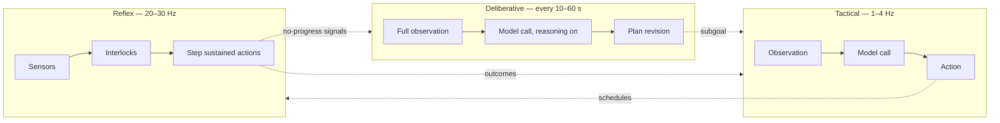
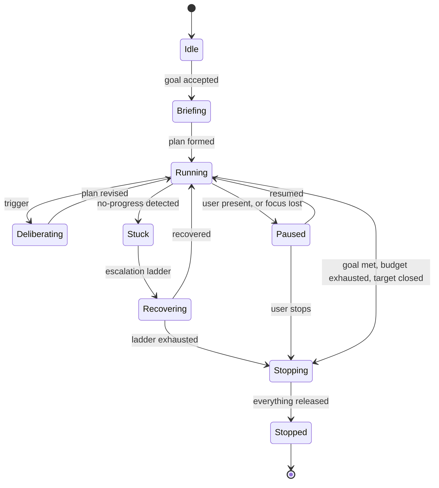
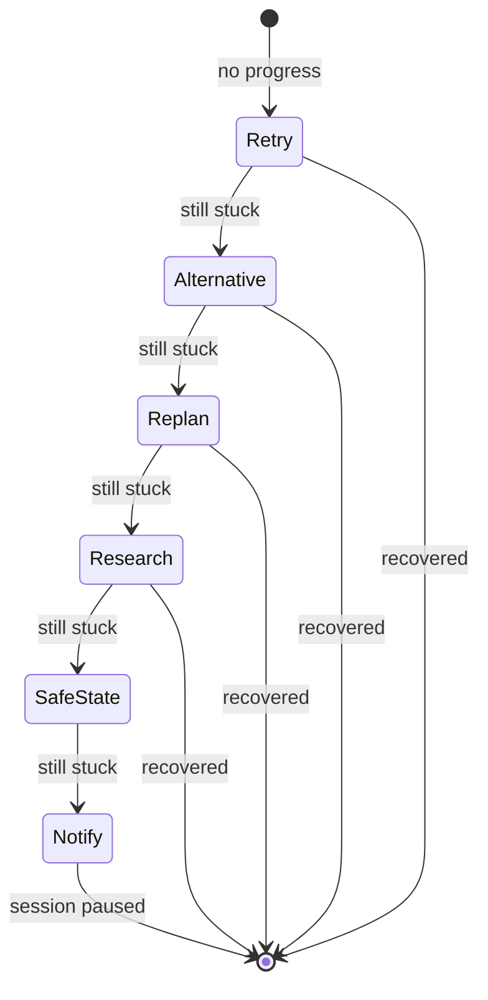

# Reasoning loop

## Purpose

This page specifies how the agent decides what to do: the three rates at which decisions are made, the shape of a plan, and how the agent notices that it is getting nowhere.

It sits between [perception](04-perception.md), which produces observations, and [action and input](06-action-and-input.md), which executes decisions.

## Three cadences

`FR-LOOP-001`.

| Cadence | Rate | Model | Question it answers |
| --- | --- | --- | --- |
| **Reflex** | 20–30 Hz | None | What input should be delivered this instant? |
| **Tactical** | 1–4 Hz | Small visual budget, no extended reasoning | Given this subgoal and this screen, what next? |
| **Deliberative** | Every 10–60 s, or on trigger | Large visual budget, extended reasoning | Is the plan still right? |



### Why three and not one

A single loop has to pick one rate, and every choice is wrong.

At model speed it cannot hold a key down, because holding requires being present every frame.
At frame speed it cannot afford a model, by roughly two orders of magnitude.
In between it does neither well.

Splitting them lets each run at the rate its work actually needs.
The reflex loop is cheap and constant.
The tactical loop is the agent's attention.
The deliberative loop is expensive and rare, and its latency is hidden because the other two keep working while it thinks.

### The reflex loop never blocks

`FR-LOOP-002`, `NFR-LOOP-001`.

The reflex loop never waits on a model call, a network operation, or a lock a worker might hold.
If it did, held input would stop being stepped, and the visible result in-game is a stutter — the character stops walking mid-stride every time the agent thinks.

The tactical and deliberative loops run as separate tasks.
While either is in flight, the reflex loop continues executing the last accepted plan.
A deliberative pass taking fifteen seconds is invisible, because for those fifteen seconds the agent is still doing the last thing it was told to do.

## The session state machine

`FR-LOOP-008`.



**Briefing** is where a long-horizon goal is turned into something actionable.
For "get through this level" the agent does not yet know what that involves, and this is where it finds out — including, if warranted, by [researching it](08-context-and-research.md).

**Stopping** always releases input before anything else.
If flushing the recording hangs, the user still has their keyboard back.

`INV-LOOP-001` — at most one plan is active.
Two plans would mean two owners for the same key, which the executor cannot resolve.

## The plan

`FR-LOOP-003`, `FR-LOOP-004`.

A tree of subgoals, revised only by the deliberative cadence.
Letting the tactical loop rewrite the plan produces thrashing: it sees one screen and would rewrite the strategy from it.

Each subgoal carries:

```text
description      what this achieves, in words
precondition     a sensor expression, or none
postcondition    a sensor expression — REQUIRED
budget           wall-clock, and a step count
fallbacks        ordered alternatives if the primary approach fails
children         subgoals, or a leaf
```

### The postcondition requirement

`FR-LOOP-004`, and the most consequential rule on this page.

When the deliberative model proposes a subgoal, it must also state **how the agent will know it worked**, as a sensor expression rather than as prose.

"The shop is open" is not a postcondition.
`template_present("shop_panel")` is.

The reason is cost.
A checkable postcondition is evaluated in the reflex loop for a fraction of a millisecond, which means every subgoal can be checked continuously.
A prose postcondition requires a model call to evaluate, which means checking becomes something the agent does occasionally, and an agent that only occasionally checks whether it is succeeding spends most of its time not knowing.

When the model cannot produce a checkable predicate, the subgoal falls back to a scheduled visual checkpoint.
That path exists, and it is the exception rather than the arrangement.

## Deliberative triggers

`FR-LOOP-007`.

| Trigger | Why |
| --- | --- |
| Scene change | The screen is materially different; the plan may not apply |
| Subgoal completed | Time to choose the next one |
| Subgoal budget exhausted | The approach is not working |
| No-progress detected | Something is wrong that the tactical loop cannot see |
| Heartbeat timer | Catches slow drift that nothing else notices |
| Research result arrived | New information that may change the plan |
| User edited the goal | Obviously |

The heartbeat exists because every other trigger is an event, and the characteristic failure of an event-driven planner is the situation where nothing happens at all.

## No-progress detection

`FR-LOOP-005`.
Four independent signals, any of which fires.

| Signal | Detects |
| --- | --- |
| **Perceptual stasis** | The screen is not changing while actions are being issued. Input is going nowhere. |
| **Progress stall** | A declared progress sensor has not moved within its window. Actions land but achieve nothing. |
| **Cycle** | The pairing of screen state and action repeats. The classic menu ping-pong. |
| **Verification failure rate** | An elevated share of actions produce no confirmed change. Grounding has broken down. |

Four rather than one because each misses what the others catch.
Stasis misses an agent walking in circles, because the screen changes constantly.
Progress stall misses a case with no progress sensor.
Cycle detection misses slow drift.
Verification rate misses an agent doing exactly what it intended, correctly, towards the wrong goal.

## The escalation ladder

`FR-LOOP-006`.
Ordered, and each rung is attempted only after the previous one failed.



1. **Retry** with jitter. Some failures are timing.
2. **Alternative action** from the subgoal's fallback list.
3. **Re-perceive and replan** — a deliberative pass at the largest visual budget, with the two-stage refinement described in [grounding](18-grounding-and-verification.md).
4. **Research.** Being stuck is the clearest available signal that the agent lacks *knowledge of the game* rather than *perception of the screen*. This is where the research skills earn their place in the loop rather than being an accessory.
5. **Return to a known-safe state** — close menus, return to a hub, respawn. Resets the situation rather than the plan.
6. **Pause and notify the user.** The agent has run out of ideas, and continuing to act while confused is worse than stopping.

Without an ordered ladder an agent does one of two things: gives up on the first failure, or loops forever.
Both are worse than an ordered sequence with an end.

## The tactical call

Each tactical tick:

1. Take the current observation.
2. Assemble the prompt as specified in [context and research](08-context-and-research.md).
3. Generate the grammar from the currently valid targets and tool schemas.
4. Call the model, constrained.
5. Validate the result.
6. Hand it to the executor, or reject it and report why.

The grammar is regenerated every tick because the valid marks change every tick.
This is what makes a reference to a non-existent target impossible rather than merely unlikely.

## Interruption

| Event | Response |
| --- | --- |
| User input detected | Pause, release, cooldown, require explicit resume |
| Focus lost | Release, pause |
| Panic key | Release, halt, stop |
| Budget exhausted | Return to safe state, stop, notify |
| Target window closed | Stop |
| Model host unreachable | Pause, report, offer retry |

All of these are handled in the reflex loop or below it, never by the model.

## Determinism and replay

`FR-OBS-002` requires a session to be replayable.

Every input to every decision is recorded: the observation, the assembled prompt, the model's output, the validation result, and the executed action.
Given the same recording and the same model seed, replay produces the same action sequence.

This is the only way to test a stochastic agent repeatably, and it is also the only way to debug a failure that happened while nobody was watching — which, for this project, is all of them.

## Open questions

1. The thresholds for all four no-progress signals are empirical and need the recorded corpus.
2. Whether the tactical cadence should vary with scene class. A menu needs a higher rate than a loading screen, and the current design is a fixed rate.
3. How deep a plan tree is allowed to get. Unbounded depth is a way for a deliberative model to avoid ever acting.
4. Whether research should be reachable from the tactical loop rather than only from the ladder. It would be faster to react; it also risks the fast loop spending the session reading.
5. What happens when the deliberative model proposes a subgoal whose precondition is already false. Currently undefined.
6. Whether rung 5 — returning to a safe state — can be defined without per-game knowledge. Closing menus generalises; "return to a hub" does not.

## Related decisions

`ADR-0012` will record the loop architecture and `ADR-0027` the error and recovery policy.
Neither is accepted.
