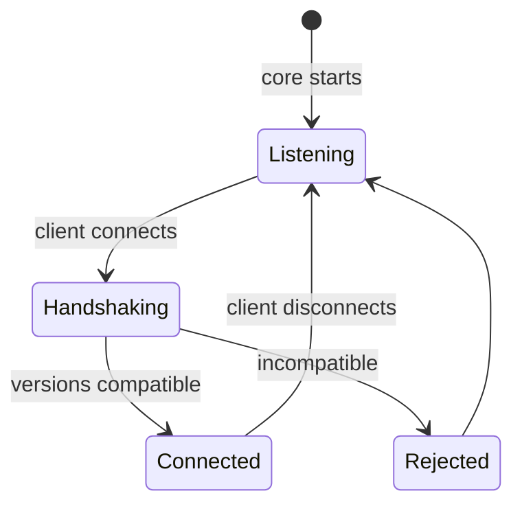

# Inter-process protocol

## Purpose

This page specifies how the core, the shell, the overlay and the guardian talk to each other.

Four channels, because they carry four kinds of traffic with incompatible requirements, and a single channel serving all four would be wrong for at least three of them.

## The channels

| Channel | Transport | Carries | Volume | If it fails |
| --- | --- | --- | --- | --- |
| **Control** | Named pipe, message-framed | Commands, events, queries | Under 100 per second | Session continues; interface degrades |
| **Telemetry** | Shared memory ring | What the overlay draws each tick | Per tick | Frames dropped, which is correct |
| **Frame** | Shared texture handle | The annotated frame for the live view | Per tick, when shown | Live view stops |
| **Panic** | A single shared value | The halt flag | On demand | **Unacceptable** — see below |

### Why the panic channel is separate

`FR-SAFE-001`.

It must work when the pipe is dead, the ring is full, and the core is in a state where nothing else is being serviced.

A halt mechanism that depends on the machinery that has stopped working is not a halt mechanism.
So it is one value in its own allocation, polled by the reflex loop, with no framing, no queue and no dependency on anything else on this page.

## Control channel

A per-user named pipe in message mode, access-controlled to the current user so no other account can drive the agent.

Framing is a length prefix plus a compact binary encoding.
Human readability is not worth the cost here: the logs are the readable artefact, and the pipe carries frames at tick rate when the live view is open.

### Commands — interface to core

| Command | Effect |
| --- | --- |
| `StartSession` | Goal, target window, budgets |
| `StopSession` | Graceful stop, releasing input first |
| `PauseSession` / `ResumeSession` | |
| `UpdateGoal` | Replace the goal mid-session |
| `SetConfig` | Change a setting, subject to `INV-CFG-001` |
| `ConfirmAction` | Answer a confirmation gate |
| `AnswerQuestion` | Answer an `ask_user` skill |
| `AttachLiveView` / `DetachLiveView` | Start or stop frame-channel publication |
| `Heartbeat` | From the overlay, for the dead-man switch |

`SetConfig` cannot reach a safety limit.
The refusal is enforced in the core, not by the shell declining to send it.

### Events — core to interface

| Event | Carries |
| --- | --- |
| `SessionState` | The state machine's current state and why |
| `PlanUpdated` | The plan tree |
| `ActionExecuted` | The action, target, grounding path |
| `VerificationOutcome` | Confirmed, refuted, inconclusive, with evidence |
| `SkillInvoked` / `SkillReturned` | |
| `StuckDetected` | Which signal, which ladder rung |
| `ConfirmationRequired` | What is being asked and why |
| `QuestionAsked` | From `ask_user` |
| `Metric` | Sampled metrics for the shell |
| `LogEvent` | Structured events |
| `Error` | A code from [the taxonomy](16-error-taxonomy.md) |
| `FrameHandle` | A shared texture handle, when the live view is attached |

### Queries

`GetState`, `GetPlan`, `GetHistory`, `GetConfig`, `GetCapabilities`.

Queries exist so a shell that attached late can catch up without the core having to replay its whole event stream.

## Ordering and delivery

| Property | Guarantee |
| --- | --- |
| Ordering | Per-channel, in order |
| Delivery, control | Reliable while connected |
| Delivery, telemetry | Best effort; dropping is correct |
| Idempotency | Commands carry an identifier and may be retried safely |
| Backpressure | The core never blocks on a slow reader |

That last row is the important one.
A shell that stops reading must not be able to stall the agent, so control-channel writes to a full pipe are dropped after a bounded buffer, with a dropped-event counter so the gap is visible rather than silent.

## Connection lifecycle

The handshake exchanges protocol version and capabilities.
An incompatible client is rejected with a clear reason rather than being allowed to half-work.

**Disconnection is not a session-ending event for the shell** (`FR-GUI-004`) — the agent keeps playing.
**It is for the overlay** (`INV-GUI-001`), because the overlay carries the panic key and the visible indicator, and an agent with hands and no visible stop control is the thing this project must never produce.

### Reattachment

A shell that reconnects performs the handshake, issues the catch-up queries, and resumes.
Sessions are discoverable by enumerating the per-user pipes.

## The guardian channel

Not a protocol so much as an arrangement.

The guardian holds a handle to the core process and a read-only view of the memory the executor publishes its held-input set into.
It waits on the process handle.
If the core exits without having cleared the set, the guardian releases those inputs (`FR-SAFE-003`).

No messages, no framing, nothing to go wrong.
A guardian that needed a working protocol to do its job would be a guardian that fails in exactly the circumstances it exists for.

## Versioning

The protocol carries its own version, independent of the application's.

| Change | Requires |
| --- | --- |
| New event | Minor bump; older clients ignore unknown events |
| New optional field | Minor bump |
| New command | Minor bump; clients check capabilities |
| Removed or changed field | Major bump; incompatible |
| Changed semantics | Major bump, even if the shape is unchanged |

The last row is the one that gets skipped.
A field that keeps its name and changes meaning is worse than a removed one, because nothing fails until something quietly does the wrong thing.

## Single source of truth

The message catalogue is defined once, in a schema file, and both the Rust and the C# types are generated from it.
The reference page is generated from the same file.

Hand-written types on both sides of a boundary drift, and the drift is discovered at runtime.

## Open questions

1. Whether the shell should be able to attach to a core started by another user session. Currently no, and per-user access control assumes that stays so.
2. What the control channel does when the shell is slow enough to hit the buffer bound repeatedly. Dropping with a counter is specified; whether the shell should be disconnected instead is not.
3. Whether the frame channel should publish when no live view is attached. Publishing unconditionally is simpler; it also costs graphics time for nothing.
4. Whether the overlay's heartbeat interval and the dead-man timeout are correct at their current values. Too short and a momentary stall stops a session; too long and the user is without a stop control for that period.
5. Whether the guardian should also watch the overlay. It would close the gap where the overlay dies and the core has not yet noticed.

## Related decisions

`ADR-0004` records the control transport, `ADR-0005` the data-plane transports, and `ADR-0016` where the message catalogue lives.
All three are accepted.
`ADR-0017`, the technology that crosses the process boundary from managed code, is not written.
