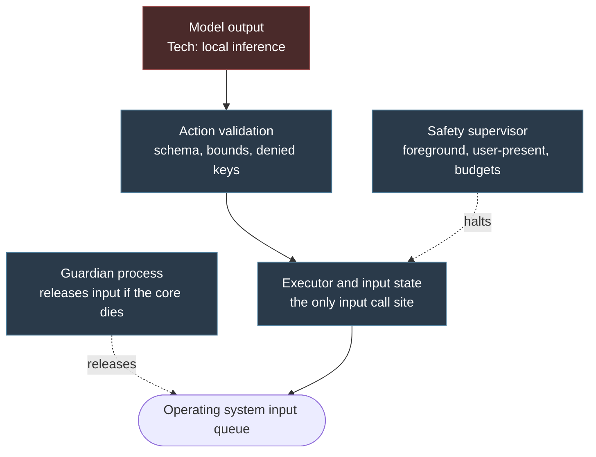

# Safety and limits

## Purpose

This page specifies every mechanism that bounds what the agent can do, and where each one sits.

It is written early, before the loop it constrains, on purpose.
Safety here is architecture and not a feature: a stop mechanism added after the fact inherits the latency and the failure modes of whatever it was bolted onto, and by then the thing it most needs to survive — an unresponsive core — is exactly the thing it depends on.

The governing rule is `INV-SAFE-001`: **every interlock on this page sits below the model.**
A model may change what the agent attempts.
None of them can change what the agent is permitted to do.

## The layering

Model output is untrusted input to the system, in the same category as text scraped from a web page.
Everything below the validation step is trusted code that the model cannot reach, reconfigure or reason about.

The guardian is a separate process, deliberately: the failure it exists for is the core dying, and a mechanism that lives inside the thing that died cannot help.

## The panic key

`FR-SAFE-001`, `NFR-SAFE-001`.

**Binding.** A global hotkey, registered by the overlay process rather than the core.
The overlay is the process least likely to be blocked — it does no inference, no capture and no heavy allocation — and it is the process the user can see.
A second binding is registered as a fallback, because hotkey registration can fail when another application already holds the combination.

**Latency budget.** From key press to the last release event: **100 ms**.

This bound is what makes the mechanism worth having.
An interlock with an unstated bound is a hope.

**What it must survive.** The core being wedged in a model call, blocked on the graphics device, or deadlocked.
The panic path therefore does not route through the core's normal message handling.
It sets a flag in memory shared with the core and, if the core has not acknowledged within the budget, the overlay releases the input itself using the last published set of held inputs.

**What it does, in order:**

1. Set the halt flag.
2. Synthesise a release for every key and button recorded as held.
3. Cancel any inference in flight.
4. Cancel every scheduled sustained action.
5. Move the session to a stopped state that requires an explicit restart.

Step 2 comes before everything else and is idempotent.
If the agent is holding a movement key when the user panics, every millisecond before that release is a millisecond the character is still walking.

!!! danger "Releasing held input is the whole point"

    The most common serious failure in input automation is not a wrong click.
    It is a key left held after a stop, which the user cannot undo from outside the game and may not immediately understand.
    `INV-SAFE-002` — after any stop, panic, focus loss or crash, nothing remains held — is the invariant the entire input layer is shaped around.

## The foreground guard

`INV-ACT-001`.

Every input event is gated on the target window still being the foreground window.
This is the primary control on blast radius: it is the mechanism that stops the agent typing into a chat application, a terminal, or a browser address bar when something unexpected takes focus.

It is checked at the point of delivery, not at the point of decision.
A check performed when the action was chosen, hundreds of milliseconds earlier, proves nothing about the moment the key is pressed.

On losing foreground, the executor releases everything held and pauses.
It does **not** attempt to restore focus to the game.
Stealing focus back while the user is typing somewhere else is the worst thing this software could do, and an agent that does it once will not be trusted again.

## User-present detection

`FR-SAFE-002`.

The agent must yield the moment a human touches the keyboard or mouse, without the human having to find a control first.

The difficulty is distinguishing the user's input from the agent's, since both arrive through the same queue.
Windows marks synthesised input, and the detection reads that mark.

On detecting genuine user input:

1. Pause immediately and release everything held.
2. Show a banner in the overlay saying why.
3. Stay paused for a cooldown period, so that a single stray keystroke does not produce a stutter of pause and resume.
4. Require an explicit action to resume.

Note that elapsed-idle-time APIs are useless here, because the agent's own synthesised input resets them.

## The guardian

`FR-SAFE-003`.

A small separate process whose only responsibility is to release all held input if the core terminates unexpectedly.

It holds a handle to the core process and a read-only view of the shared memory the executor publishes its held-input set into.
When the core exits without having cleared that set, the guardian synthesises the releases.

It contains no model, no capture, no configuration, and as little code as the job allows, because the one thing it must never do is crash for the same reason the core did.

## Budgets

`FR-SAFE-004`.
All enforced below the model, and the model cannot raise any of them.

| Budget | Applies to | Behaviour on exhaustion |
| --- | --- | --- |
| Session wall-clock | The whole session | Return to a safe state, stop, notify |
| Subgoal wall-clock | One subgoal | Abandon the subgoal, force deliberation |
| Actions per minute | The executor | Throttle, then stop if sustained |
| Clicks per minute | The executor | Throttle, then stop if sustained |
| Maximum hold duration | One key or button | Force release and raise an alarm |

The maximum hold duration deserves its own note.
A key held for more than a small number of seconds is almost always a defect rather than an intention — a sustained action whose cancellation was lost, or a subgoal that was abandoned without releasing its leases.
Forcing the release converts a session-ruining bug into a logged anomaly.

## Denied inputs

`INV-ACT-003`.
Never synthesised, regardless of model output, configuration, or skill invocation.

- Window and session control: the close-window combination, the lock-screen combination, the task-manager combination, and the application-switch combination unless explicitly enabled for a game that requires it.
- Any key outside the profile of keys the game is known to use, where such a profile is available.
- Text entry into anything identified as a chat field, unless the user has explicitly enabled it. It is off by default, and it is also the route by which [another player could attempt to manipulate the agent through text on screen](14-threat-model.md).

This list is enforced in the executor, at the point of synthesis.
Enforcing it earlier — in the prompt, in validation — is also worth doing, but only the last check counts.

## Confirmation gates

`FR-SAFE-005`.

Certain categories require explicit human confirmation and cannot be performed unattended:

- Anything involving real currency.
- Trading, gifting, or transferring items to another player.
- Deleting or permanently consuming an item.
- Changing account settings or credentials.

These are code paths, not prompt instructions.
A prompt instruction is a request; a code path is a guarantee, and the distinction matters precisely because the model is the component being guarded against.

**Open problem.** Recognising these categories without understanding the game is unsolved.
The current candidate is to detect the *confirmation dialogue* rather than the action, on the observation that games reliably put one in front of anything irreversible — which converts a game-specific semantic problem into a general perception problem.
This is question 1 in [requirements](01-requirements.md) and is not yet settled.

## Dry-run mode

`FR-SAFE-006`.

The agent perceives, plans and decides, and logs every action it would have taken without synthesising any input.

Intended for the first minutes on an unfamiliar game, where it costs nothing and shows the user exactly what the agent intends before granting it hands.
Also the mode in which the reachability and grounding experiments run.

## The visible indicator

`FR-SAFE-007`.

Whenever the agent is capable of delivering input, the overlay shows it.
Not "whenever it is acting" — whenever it *could* act.
The distinction matters because an agent that is thinking is still an agent that will move in half a second, and a user must never have to guess.

The indicator also carries the panic key binding, so the recourse is on screen rather than in a document.

## What this page does not cover

Deliberately excluded, because they are a different kind of risk and belong in the [threat model](14-threat-model.md):

- Text on screen or in a fetched web page attempting to instruct the agent.
- A malicious skill.
- Privacy of session recordings.

## Invariants

The four invariants this page depends on, all *defined* in [requirements](01-requirements.md):

- [`INV-SAFE-001`](01-requirements.md) — no model-driven component can relax, disable or raise any limit on this page.
- [`INV-SAFE-002`](01-requirements.md) — after any stop, panic, focus loss or crash, no input remains held.
- [`INV-ACT-001`](01-requirements.md) — no input is delivered while the target window is not the foreground window.
- [`INV-ACT-003`](01-requirements.md) — no denied key is synthesised under any circumstances.

If any one of these fails, the rest of this page is decoration.

## Open questions

1. **Blocking.** The 100 ms panic budget is asserted, not measured. It must be validated against hotkey delivery latency under load before it becomes a requirement rather than an intention.
2. **Blocking.** Which mechanism reliably distinguishes synthesised from genuine input, and whether it can be read without installing a low-level hook. A hook works but adds a component in the path of every keystroke the user makes, which is its own risk.
3. **Blocking.** Whether the guardian should also enforce the session wall-clock budget, so that a core which hangs while holding input stops rather than waiting for the user.
4. **Blocking.** What the fallback is when both panic-key registrations fail because other applications hold the combinations. Currently there is none, which is not acceptable.
5. **Blocking.** Whether losing foreground should pause or stop. Pausing is friendlier; stopping is safer when the user has walked away and something else stole focus for reasons nobody is present to understand.

## Related decisions

`ADR-0009` records the input injection method that this page constrains and is accepted.
`ADR-0024`, the safety architecture, is not written.
