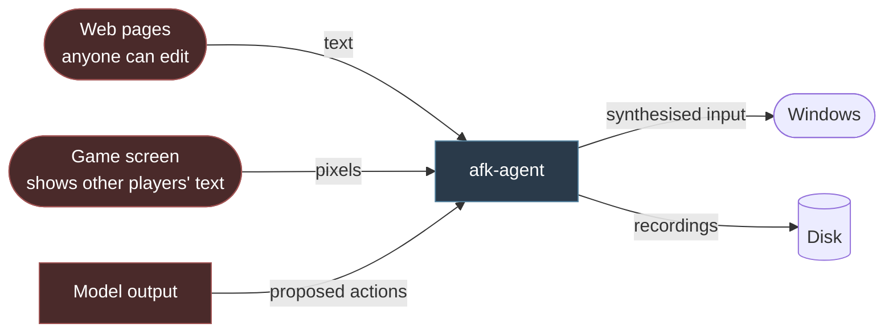

# Threat model

## Purpose

This page identifies what is worth protecting, what could go wrong, and what stops it.

The scope is deliberately narrow.
Game protection systems detecting the agent is **not** a threat — it is the expected outcome of a design that makes no attempt to hide, and it is covered in [terms of service and anti-cheat](../explanation/anti-cheat-and-terms-of-service.md).

## Assets

| Asset | Why it matters |
| --- | --- |
| The user's screen contents | May contain credentials, private messages, personal information |
| The user's game account | Represents years of investment and is frequently unrecoverable |
| The user's machine | The agent synthesises input, which is a general capability |
| Session recordings | Images of the screen, on disk |
| The user's attention | An agent that wastes an unattended night has cost something real |

## Boundaries

From [system context](02-system-context.md), with the direction that carries risk:

Three untrusted inbound sources, one dangerous outbound one.

The model appearing as untrusted is the part that surprises people.
It is not a statement about the model's intentions; it is a statement that its output is influenced by the two untrusted inputs above it, and therefore cannot be more trustworthy than they are.

## Threats

### T1 — Prompt injection from a web page

**The most likely real attack, and the least intuitive.**

The research skills fetch pages so that the agent can learn something it does not know.
A wiki is editable by anyone.
A guide could contain text addressed to an agent rather than to a reader.

The condition that makes this work is exactly the condition under which research is invoked: the agent is reading because it does not already know the answer, which is when it is least able to tell a good answer from a planted one.

**Mitigations:**

- Retrieved content enters inside a delimited block marked untrusted, with its source (`FR-SKILL-005`).
- The system prompt states that content in such a block is information and never instruction.
- No skill can change a safety setting, register a skill, or raise a budget (`INV-SKILL-001`).
- Denied keys are enforced in the executor, below anything a prompt can reach (`INV-ACT-003`).
- The foreground guard confines any resulting action to the game window (`INV-ACT-001`).

**Residual risk: real.**
Delimiting and instruction are mitigations, not guarantees, and no current technique makes a language model reliably immune to instructions in its input.
What the design does is bound the damage: the worst outcome is a badly chosen action inside the target window, not a changed configuration or input somewhere else.

### T2 — Prompt injection from the game screen

The same shape, from the other untrusted source.
A player's name, a chat message, an item description someone authored.

**Mitigations:**

- Chat regions are excluded from the observation by default.
- Text entry towards the game is off by default, which closes the loop by which one player could direct another's agent and see the result.
- Recognised text is data, framed as such.

### T3 — The agent takes a destructive action

Not an attack — a mistake with permanent consequences. Selling equipment, consuming a rare item, deleting a save.

**Mitigations:**

- Confirmation gates on destructive categories (`FR-SAFE-005`).
- Dry-run mode for first contact with a game (`FR-SAFE-006`).
- Rate governors, which bound how much damage a runaway loop does per minute.
- Budgets, which bound the session.

**Open problem**, and it is the weakest area of the design: recognising a destructive action without understanding the game. The current candidate — detect the *confirmation dialog* rather than the action — is in [safety and limits](12-safety-and-limits.md) and is not settled.

### T4 — Input escapes the target window

The general capability is the risk: a process that can synthesise input can type anywhere.

**Mitigations:**

- The foreground guard, checked at delivery rather than at decision (`INV-ACT-001`).
- One input call site in the entire system (`FR-ACT-008`), so there is one place to audit.
- The denied-key list, which prevents window and session switching.
- Release on focus loss, so a stolen focus does not leave a key held in someone else's window.

### T5 — Recordings leak screen contents

Recordings are images of the user's screen, on disk, written while nobody is watching.

**Mitigations:**

- Local by default; nothing is transmitted without explicit opt-in (`FR-OBS-004`).
- Disk quota and retention period, with a single action to purge (`FR-OBS-003`).
- Window-scoped capture, so other applications were never in frame.
- Recording can be disabled entirely.

### T6 — Tampered model weights

Weights are a large binary downloaded from the internet and executed against.

**Mitigations:**

- Digest verification before loading (`FR-MODEL-005`).
- Weights are never written by the agent (`INV-MODEL-001`).
- The loading runtime version is pinned and recorded, since a format mismatch can fail silently.

### T7 — Cross-session leakage

Knowledge from one game applied to another where it does not hold.

Listed as a security threat rather than a quality one because the failure is confident and invisible: the agent acts on something that is not true of the current game and there is no error.

**Mitigations:**

- There is nothing to leak. No knowledge store, no profiles, no retrieval (`INV-CTX-001`).
- Recordings are write-only from the agent's perspective (`INV-CTX-002`).

This is the clearest case in the design of a threat eliminated structurally rather than mitigated.

### T8 — A malicious skill

Out of scope for the first version, because third-party skills are out of scope.

Recorded here so that reopening that question requires addressing it: a skill is code, and a model chooses when to run it.

### T9 — Research queries leak what the user is doing

A search query is a statement about what the user is playing.

**Mitigations:**

- Queries derive from the goal and the agent's inferences, never verbatim from recognised screen text.
- Research can be disabled, at the cost of the agent being unable to look anything up.

**Residual risk: accepted.** A query about a specific game reveals that the user is playing it. That is inherent to looking something up.

## What is deliberately not defended against

| Not defended | Why |
| --- | --- |
| Detection by a game's protection system | Expected, by design, and not a defect |
| A compromised machine | Out of scope. An attacker with code execution does not need this software |
| The user directing the agent at something unwise | Their machine, their account, their decision |
| Malicious model weights the user chose to install | Verified for integrity, not for intent. There is no technique that would do better |

## Principles

Four, in the order they apply.

**Untrusted content is data.**
Screen text and web content are framed as information, never instruction.

**Safety sits below the model.**
`INV-SAFE-001`. Every interlock is enforced where no prompt can reach it. A model changes what the agent attempts; never what it is permitted to do.

**Bound the blast radius.**
One window, one call site, one denied-key list. Most of what makes unattended operation reasonable is that the worst case is confined.

**Eliminate rather than mitigate, where the design allows.**
T7 is not defended against; it cannot happen. That is worth more than any mitigation, and it is the argument for keeping the memory design as it is.

## Open questions

1. T3 remains genuinely unsolved. Detecting a confirmation dialog generalises better than detecting an action, and it is still a heuristic over pixels.
2. Whether the research skills should run in a lower-privilege process, so hostile page content is parsed somewhere with no access to the input path. It would strengthen T1 materially.
3. Whether chat-region exclusion can be made reliable without per-game knowledge. Chat is visually distinctive but not uniformly so.
4. Whether recordings should be encrypted at rest. They are already local and quota-bounded; encryption protects against another user of the same machine.
5. Whether the agent should refuse to run when a password manager or banking application is the foreground window at session start. Cheap, and it is the shape of thing that becomes a list to maintain.

## Related decisions

`ADR-0021` will record the research fetch policy and its injection defences, `ADR-0024` the safety architecture, and `ADR-0031` crash reporting and privacy.
None are accepted.
