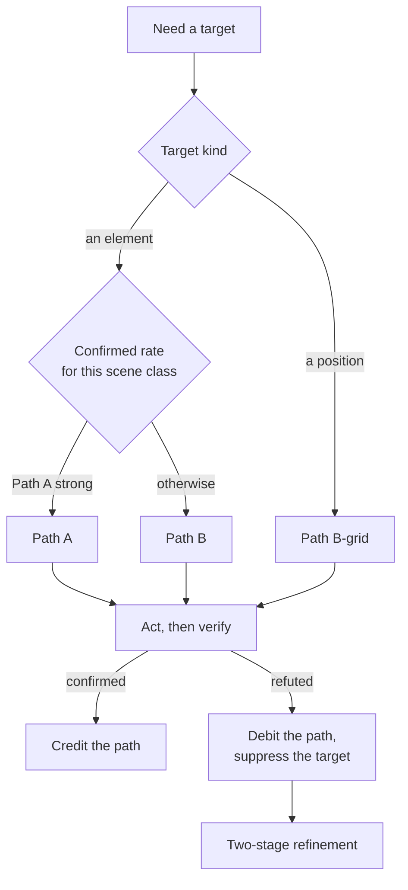

# Grounding and verification

## Purpose

Two problems, specified together because each is the other's feedback.

**Grounding** turns "the shop button" into a screen coordinate that hits the shop button.
**Verification** determines whether the resulting action did what it was meant to do.

Verification measures grounding, which is what allows the system to choose between grounding strategies on evidence rather than on belief.

## The state of the art, and what it means here

Published results give a usable sense of the difficulty.

A pipeline combining an interface parser with a general-purpose model reaches roughly 39.5% on a demanding high-resolution grounding benchmark.
Purpose-built agents trained end to end on interface trajectories do considerably better — around 72.9% on the same benchmark, rising to about 80.3% with a two-stage refinement pass.

Two conclusions, and only the second is available to this project.

The specialist-versus-generalist gap comes from training, and this project [does not train](../explanation/why-the-agent-does-not-learn.md).

**The refinement gap does not.**
Those last eight points come from asking the same model twice — once to localise, once to resolve — and that is a property of how the model is queried.
It is available for free, and `FR-GND-005` requires it.

**No published grounding results exist for the model family this project targets.**
Its direct-coordinate ability is unknown in both directions.
That is why two paths are specified rather than one, and why the arbiter is a measurement rather than a preference.

## Two paths

### Path A — direct coordinates

`FR-GND-002`.
The model returns a normalised position, which is converted through the transform chain.

**Good at:** targets the perception layer did not detect — a point on the ground, a spot in a world view, an element the detector missed.
Flexible, and requires nothing from perception.

**Bad at:** precision. An error of 2% of the frame width is tens of pixels, which for a small interface element is a miss. Nothing structurally prevents a plausible-looking but wrong answer.

### Path B — marks

`FR-GND-001`, `FR-GND-003`.
Perception enumerates candidates and draws numbered marks; the model chooses an integer.

**Good at:** anything the perception layer detected. The choice is from a finite set, so precision is perception's problem rather than the model's, and perception is measurably better at boxes than a general model is at coordinates.

**Bad at:** anything not detected. If the element is not in the list, the model cannot ask for it.

**And structurally safe**: the grammar is regenerated every tick from the marks actually present, so a reference to a mark that does not exist is not merely unlikely, it cannot be expressed.
This turns a whole class of runtime failure into a class of impossible output, and it is the single strongest reliability mechanism in the design.

### Path B-grid — coarse positions

For spatial targets with no element: a labelled grid is drawn over the image and the model names a cell plus an offset.
The grammar enumerates valid cells.

Coarse by construction — a cell is a substantial fraction of the screen — but coarse and correct beats precise and wrong, and for "walk over there" coarse is what the task needs.

## The arbiter

`FR-GND-004`.

Neither path is chosen in advance.
Both are implemented, and the system tracks which is working.



Per **scene class**, the system counts how often each path produced a confirmed outcome.
Path A is used where it has earned it; Path B is the default elsewhere.

Two properties matter:

- **The counters are session-scoped.** They are derived from what happened in this session, on this screen, and they are discarded with it. Nothing about a game persists (`CON-006`).
- **The benchmark sets the starting point, not a per-game default.** The [evaluation harness](20-evaluation-harness.md) measures both paths on a labelled corpus and fixes one global initial preference. Per-game defaults would be a per-game profile by another name.

## Two-stage refinement

`FR-GND-005`.

When confidence is low, when the target is described but unmatched, or after a refuted attempt:

1. Ask over the whole frame at a **small visual budget**: which region contains the target?
2. Crop that region, re-derive marks within it, and ask again at a **large visual budget**.

Two cheap calls beat one expensive call that misses, because a miss costs an action, a verification cycle, and a place on the stuck ladder.

This is the mechanism behind the published refinement gap, and it is the one part of the specialist agents' advantage that is available without training.

## Sensor expressions

The language postconditions are written in.
Evaluated on the graphics device every reflex tick, without a model.

```text
health        = region_fraction([40,900,300,24], hue=[0,10], saturation>0.5)
carrot_count  = region_integer([1700,60,120,40])
in_menu       = template_present("pause_panel", 0.9)
shop_open     = template_present("shop_header", 0.85)
progressed    = carrot_count > @carrot_count
```

Three primitives — a fraction of matching pixels, an integer read by text recognition, a template match — plus comparison, boolean combination, and a reference to a previous value.

Deliberately not a general language.
Everything here is bounded, evaluable in constant time, and cannot fail in a way that blocks a tick.
The full grammar is in the reference documentation.

## Verification

`FR-GND-006`, `INV-GND-001`.

After every action, within a bounded window:

| Outcome | Means | Evidence |
| --- | --- | --- |
| **Confirmed** | The expected change occurred | A postcondition sensor became true, or the expected local change appeared |
| **Refuted** | The expected change did not occur, and the screen was in a state where it should have | The window elapsed with no change, in a settled scene |
| **Inconclusive** | Cannot be determined | The sensor was unavailable, the scene changed for another reason, the frame was mid-transition, the game was loading |

### Why the third value is not optional

Collapsing inconclusive into either neighbour breaks the loop in a different way each time.

Fold it into **confirmed** and the agent becomes credulous: it proceeds on the assumption that things worked, and discovers otherwise three or four subgoals later, when the recovery is expensive and the cause is buried.

Fold it into **refuted** and the agent thrashes: every loading screen and every transition becomes evidence of failure, the stuck detector fires constantly, and the escalation ladder runs on situations that were never wrong.

The honest answer to "did that work?" is frequently "cannot tell yet", and a control loop that cannot represent that answer will act on a guess.

## Failure attribution

`FR-GND-008`.

Every refuted outcome is attributed to a cause:

| Cause | Meaning |
| --- | --- |
| **Grounding** | The action targeted the wrong place |
| **Action choice** | The right place, the wrong thing to do |
| **Perception** | The observation was wrong — a missed or misread element |
| **Plan** | The subgoal was not achievable from this state |
| **Execution** | Input did not arrive, or arrived wrong |
| **Game** | The game did not respond — loading, lag, a modal nobody saw |

The histogram over these is the project's primary diagnostic instrument.
It tells a developer what to fix next, and it replaces the usual approach of optimising whatever is most interesting.

The instinct in a system with a model in it is to blame the model.
The histogram exists to check that instinct, because a system whose text recognition cannot read a counter will present as a system whose model makes poor decisions.

## Suppression

`FR-GND-007`.

A refuted target is suppressed for a bounded number of ticks and the no-progress counters advance.

Without suppression the agent retries the same wrong target indefinitely: nothing about the observation has changed, so the model reaches the same conclusion, forever.
Suppression forces a different answer and gives the ladder something to escalate through.

Suppression is per-target and expires, because a target can be legitimately unavailable at one moment and correct a second later.

## Invariants

Restated from [requirements](01-requirements.md), where they are defined:

- [`INV-GND-001`](01-requirements.md) — verification is three-valued, and an outcome that cannot be determined is never recorded as one of the other two.
- [`INV-GND-002`](01-requirements.md) — every coordinate reaching input synthesis passed through the single transform chain.

## Open questions

1. The verification window duration is game-dependent — a menu responds in a frame, a level load takes seconds — and there is no way to know which applies without knowing the game. Current candidate: derive it from the scene class, which is itself inferred.
2. Whether the arbiter's counters should be per scene class or finer. Finer means slower to learn, coarser means it learns the wrong thing.
3. How confidently a scene can be called "settled", which the refuted outcome depends on. Getting this wrong converts inconclusive into refuted, which is the thrashing failure above.
4. Whether failure attribution can be automated at all, or whether it needs a model call. A model call per failure is affordable, since failures are rare; asking the model that failed to diagnose its own failure is not obviously sound.
5. Whether Path A should be offered at all before the benchmark has run. Enabling it with no evidence is the position this page argues against.
6. What happens when the two paths disagree — Path A returns a coordinate inside a different element than the mark Path B chose. Currently nothing detects that, and it would be a strong signal.

## Related decisions

`ADR-0036` records the three-valued verification model and is accepted, as is `ADR-0013`, which makes an unavailable mark inexpressible.
`ADR-0014`, the grounding strategy, is proposed rather than accepted, and is blocked on the benchmark in [evaluation harness](20-evaluation-harness.md).
