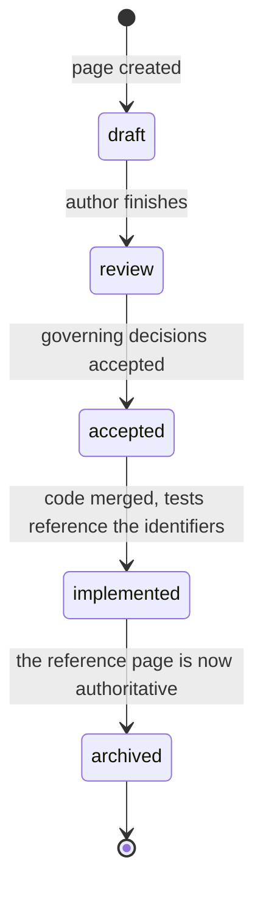

# Specification

These pages are normative.
They state what the system must do, in the present tense, whether or not any of it exists yet.

That last clause is the one that misleads people, so the status banner at the top of every page says plainly which state it is in.
A page marked `draft` or `accepted` describes behaviour nobody has built.

## How to read a page

Every specification page has the same shape:

| Section | What it contains |
| --- | --- |
| Purpose | What the page governs, and what it does not |
| Requirements | Identified statements, one per row, each with a verification method |
| Design | How the requirements are met — diagrams, state machines, schemas |
| Interfaces | What this subsystem exposes to the others |
| Invariants | What holds at all times, not only at a step |
| Open questions | Numbered, each with what would resolve it |
| Related decisions | The records that govern this page |

Read Purpose and Requirements first.
The Design section explains one way to satisfy the requirements; where it and the requirements disagree, the requirements win and the Design section is a defect.

**Open questions are not decoration.**
An empty Open questions section is a claim that none remain, and that claim is checked at review.
If you are implementing a page and have to ask something that is not listed there, the page has a defect — file it rather than guessing.

## Requirement identifiers

Format is `<KIND>-<AREA>-<NNN>`.

`FR` is a functional requirement, `NFR` a non-functional bound, `INV` an invariant that holds at all times, `CON` a constraint imposed from outside.
Areas are `PERC`, `LOOP`, `ACT`, `GND`, `SKILL`, `CTX`, `GUI`, `CFG`, `SAFE`, `OBS` and `MODEL`.

Numbers are assigned once, never reused, never renumbered.
When a requirement is withdrawn it is marked withdrawn and left in place, because tests, decision records and issues refer to it by number.

Identifiers are the join key across the whole project.
They appear in this specification, in the `affects` field of decision records, in source comments, in test attributes, and in the generated traceability table.
That is what turns the question of whether the code matches the specification into something CI can answer.

## Keywords

The words MUST, MUST NOT, SHOULD, SHOULD NOT and MAY are used as defined in [RFC 2119](https://www.rfc-editor.org/rfc/rfc2119), and only in normative statements.
Where they appear in lowercase they carry their ordinary English meaning and impose nothing.

## How a page stops being normative

Once a subsystem ships, its reference page becomes the single source of truth and the specification page moves to `_archive/` with a pointer to its replacement.
Archived pages are never deleted; the decision records point at them, and the historical statement of intent is the thing that explains why the code looks the way it does.

## The pages

**Foundations** — read these before anything else.

- [Scope and goals](00-scope-and-goals.md) — the system boundary
- [Requirements](01-requirements.md) — the spine; everything below refers to it
- [System context](02-system-context.md) — actors and trust boundaries
- [Container architecture](03-container-architecture.md) — processes and failure domains

**The loop** — perception in, action out.

- [Perception](04-perception.md)
- [Reasoning loop](05-reasoning-loop.md)
- [Action and input](06-action-and-input.md)
- [Grounding and verification](18-grounding-and-verification.md)

**Capabilities and state.**

- [Skills](07-skills.md)
- [Context and research](08-context-and-research.md)
- [Model contract](17-model-contract.md)

**Surfaces.**

- [Application shell and overlay](09-gui-and-overlay.md)
- [Inter-process protocol](10-ipc-protocol.md)
- [Configuration](11-configuration-and-profiles.md)

**Cross-cutting.**

- [Safety and limits](12-safety-and-limits.md)
- [Observability](13-observability.md)
- [Threat model](14-threat-model.md)
- [Performance budgets](15-performance-budgets.md)
- [Error taxonomy](16-error-taxonomy.md)
- [Evaluation harness](20-evaluation-harness.md)
- [Non-goals](19-non-goals.md)
